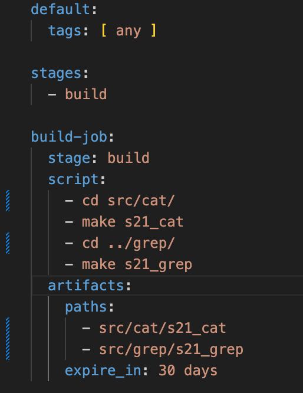

# Basic CI/CD

Разработка простого **CI/CD** для проекта *SimpleBashUtils*. Сборка, тестирование, развертывание.

## Contents

   1. [Настройка gitlab-runner](#part-1-настройка-gitlab-runner)  
   2. [Сборка](#part-2-сборка)  
   3. [Тест кодстайла](#part-3-тест-кодстайла)   
   4. [Интеграционные тесты](#part-4-интеграционные-тесты)  
   5. [Этап деплоя](#part-5-этап-деплоя)  
   6. [Дополнительно. Уведомления](#part-6-дополнительно-уведомления)

## Чтоб подключить Ubuntu (виртуальную машину) через Visual Studio Code нужно:
узнать ip твоего компьютера. На маке открыть Системные настройки - Сеть - Выбрать ваше подключение (Wi-Fi), и вы увидите ваш IP-адрес. Затем в 
Ubuntu в Настройки - Сеть - Адаптер 1 - Дополнительно - Проброс портов - Добавление - ssh - TCP - Порт хоста -22, Порт гостя - 22. Установить ssh (sudo apt update, sudo apt install openssh-server). В Visual Studio Code пишем команду `ssh username@IP-адрес`
(https://linuxhint.com/setup-enable-ssh-ubuntu-virtual-box/)

## Part 1. Настройка **gitlab-runner**

**GitLab Runner** — это программа, которая выполняет задачи в CI/CD (непрерывная интеграция и непрерывное развертывание) в GitLab. Вот основные его функции: Запуск задач, Поддержка различных окружений, Упрощение процессов CI/CD, Масштабируемость, Интеграция с GitLab.

* Подними виртуальную машину *Ubuntu Server 22.04 LTS*.
\

* Скачай на виртуальную машину **gitlab-runner**. 
\
*Вывод команды `curl -L "https://packages.gitlab.com/install/repositories/runner/gitlab-runner/script.deb.sh" | sudo bash`*

* Установи на виртуальную машину **gitlab-runner**. 
\
*Вывод команды `sudo apt-get install gitlab-runner`*

* Запусти **gitlab-runner** и зарегистрируй его для использования в текущем проекте (*DO6_CICD*).
* Для регистрации понадобятся URL и токен, которые можно получить на страничке задания на платформе.
(URL - https://repos.21-school.ru токен - GR1348941g6cC_KNgSscPrwxYpCsy)

*Вывод команды `sudo gitlab-runner start`
*Вывод команды `sudo gitlab-runner register`
\

## Part 2. Сборка

* Напиши этап для **CI** по сборке приложений из проекта *C2_SimpleBashUtils*.

* **CI** (Continuous Integration) — в дословном переводе «непрерывная интеграция». Имеется в виду интеграция отдельных кусочков кода приложения между собой. CI обычно выполняет две задачи: Build, Test.

* Скопировала папки cat и grep из проекта simpleBashUtils в папку src проекта CICD.

* Cоздала и описала файл .gitlab-ci.yml
Файл .gitlab-ci.yml - это файл конфигурации для настройки и определения задач и пайплайнов непрерывной интеграции и непрерывной доставки (CI/CD) в GitLab. В этом файле вы описываете, какие шаги должны выполняться автоматически при каждом пуше кода в ваш репозиторий. После добавления .gitlab-ci.yml файла в ваш репозиторий, GitLab CI/CD будет автоматически создавать пайплайны и выполнять задачи согласно вашим настройкам. Вы сможете видеть результаты выполнения задач в веб-интерфейсе GitLab, а также настраивать уведомления, автоматическое развертывание и другие аспекты CI/CD процесса.
Когда вы указываете tags: [ any ] внутри секции default:, это значит, что все задания будут использовать теги, позволяющие запускаться на любом раннере (runner), который подходит под эти теги. 

* В файле _gitlab-ci.yml_ добавь этап запуска сборки через мейк файл из проекта _C2_.

* Файлы, полученные после сборки (артефакты), сохрани в произвольную директорию со сроком хранения 30 дней.
*Вывод команды `sudo gitlab-runner register`
\

* Проверяю работу gitlab-runner
\

* Вначале на Ubuntu нужно установить make sudo apt-get install make и gcc sudo apt -y install build-essential, затем войти на CI/CD - Pipeline Editor - ввести gitlab-ci.yml и получить результат.

### Part 3. Тест кодстайла

`-` Поздравляю, ты выполнил абсолютно бессмысленную задачу. Шучу. Она была нужна для перехода ко всем последующим.

**== Задание ==**

#### Напиши этап для **CI**, который запускает скрипт кодстайла (*clang-format*).

##### Если кодстайл не прошел, то «зафейли» пайплайн.

##### В пайплайне отобрази вывод утилиты *clang-format*.

## Part 4. Интеграционные тесты

`-` Отлично, тест на кодстайл написан. [ТИШЕ] Говорю с тобой тет-а-тет. Не говори ничего коллегам. Между нами: ты справляешься очень хорошо. [ГРОМЧЕ] Переходим к написанию интеграционных тестов.

**== Задание ==**

#### Напиши этап для **CI**, который запускает твои интеграционные тесты из того же проекта.

##### Запусти этот этап автоматически только при условии, если сборка и тест кодстайла прошли успешно.

##### Если тесты не прошли, то «зафейли» пайплайн.

##### В пайплайне отобрази вывод, что интеграционные тесты успешно прошли / провалились.

### Part 5. Этап деплоя

`-` Для завершения этого задания ты должен перенести исполняемые файлы на другую виртуальную машину, которая будет играть роль продакшна. Удачи.

**== Задание ==**

##### Подними вторую виртуальную машину *Ubuntu Server 22.04 LTS*.

#### Напиши этап для **CD**, который «разворачивает» проект на другой виртуальной машине.

##### Запусти этот этап вручную при условии, что все предыдущие этапы прошли успешно.

##### Напиши bash-скрипт, который при помощи **ssh** и **scp** копирует файлы, полученные после сборки (артефакты), в директорию */usr/local/bin* второй виртуальной машины.
*Тут тебе могут помочь знания, полученные в проекте DO2_LinuxNetwork.*

- Будь готов объяснить по скрипту, как происходит перенос.

##### В файле _gitlab-ci.yml_ добавь этап запуска написанного скрипта.

##### В случае ошибки «зафейли» пайплайн.

В результате ты должен получить готовые к работе приложения из проекта *C2_SimpleBashUtils* (s21_cat и s21_grep) на второй виртуальной машине.

##### Сохрани дампы образов виртуальных машин.
**P.S. Ни в коем случае не сохраняй дампы в гит!**
- Не забудь запустить пайплайн с последним коммитом в репозитории.

### Part 6. Дополнительно. Уведомления

`-` Здесь написано, что твое следующее задание выполняется специально для нобелевских лауреатов. Здесь не сказано, за что они получили премию, но точно не за умение работать с **gitlab-runner**.

**== Задание ==**

##### Настрой уведомления о успешном/неуспешном выполнении пайплайна через бота с именем «[твой nickname] DO6 CI/CD» в *Telegram*.

- Текст уведомления должен содержать информацию об успешности прохождения как этапа **CI**, так и этапа **CD**.
- В остальном текст уведомления может быть произвольным.

## Chapter IV

`-` Хорошо. По завершении серии заданий сотруднику следует пройти в комнату отдыха.

Пока у тебя выдалась свободная минутка в комнате отдыха, ты, попутно размышляя о странности происходящего, решаешь проверить почту.

Не успел ты достать телефон, как в комнату отдыха зашёл ещё один человек.

`-` Привет, что-то я тебя тут раньше не видел.

`-` Было бы странно, если бы видел. Я тут первый день, хах.

`-` О, первый день! Ну и как тебе наш «босс»? - последние слова прозвучали с явной иронией.

`-` Это был босс? Фух, всё-таки он не одному мне кажется странным... и слегка грубым? Я уж думал, что вы все в Англии такие.

`-` Ахах, ни в коем случае, друг. Это просто розыгрыш для новичков, но не волнуйся, завтра всё будет в порядке. Кстати говоря, вон идет и настоящий босс, кажется, как раз к тебе. Ну, удачи, свидимся еще.

Незнакомец быстро пропал и в комнату зашел невысокий мужчина в дорогом костюме, с небольшой залысиной, навскидку лет этак 50-60 лет. Не дожидаясь твоих слов, он с тонкой, едва уловимой улыбкой произнес:

`-` Ах, вы, видимо, Томас. Поистине великолепное выполнение тестовой работы. Надеюсь, вы не испугались нашей милой подруги ASI младшей, она высоко отозвалась о вас. Итак, позвольте мне подробнее рассказать чем мы тут вообще занимаемся и какова ваша роль в нашей компании...

